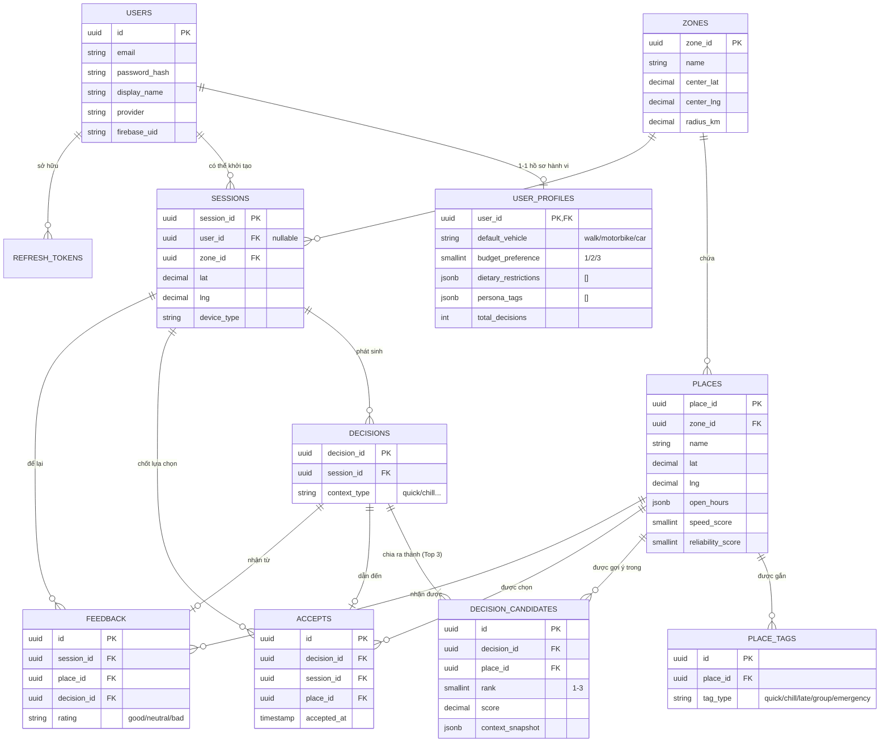

# Near Me Data Model (Production)

## Entity-Relationship Diagram (ERD)
Sơ đồ cơ sở dữ liệu hiện tại (bao gồm cả bảng mới `user_profiles`).

## Giải thích luồng
- Dữ liệu ở `user_profiles` được thu thập ngay khi user vào trang Profile.
- Khi user tìm kiếm, sinh ra bản ghi `sessions` và `decisions`.
- AI sử dụng `default_vehicle` và `budget_preference` để filter từ bảng `places`.
- Trả ra 3 quán lưu vào `decision_candidates`.
- Người dùng chọn quán nào, lưu vào `accepts`. Đóng vòng lặp.
